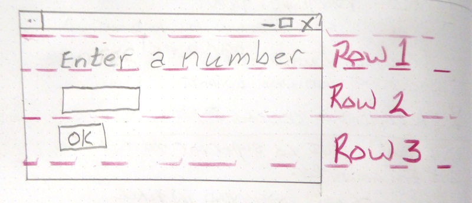
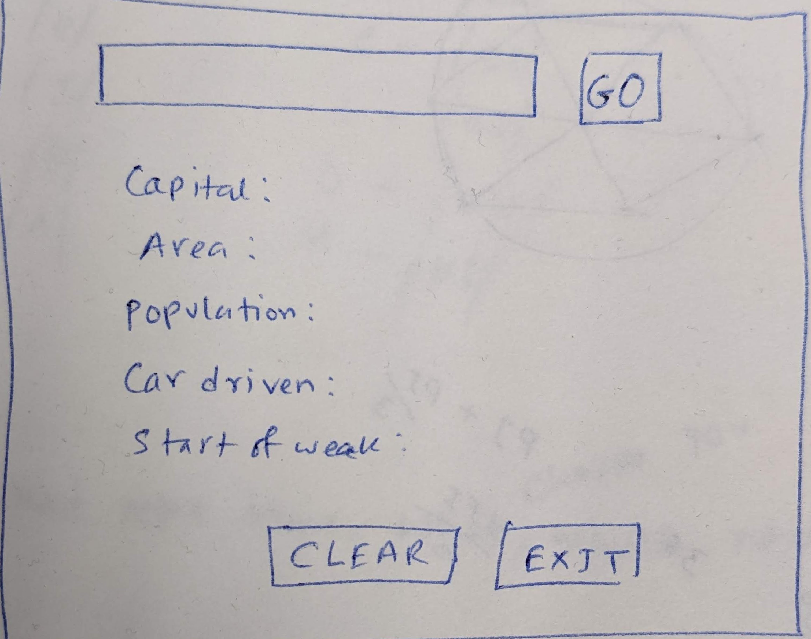

# Things you will learn
1. How to work with third party Python packages (install and use)
2. PyCharm as an IDE of choice (installation and use)
3. Making GUI applications
4. Working with API
5. Display and core logic of a program 

# Install dependencies
***
1. Python
2. PyCharm

## Moving to GUI
Installing pysimplegui

`pip install pysimplegui`

***
### Step 1: Sketch the GUI


### Step 2: Divide into rows


### Step 3: Label elements


---
A sample code
```python
import PySimpleGUI as sg

layout = [[sg.Text('Enter a Number')],
          [sg.Input()],
          [sg.OK()] ]

window = sg.Window('Enter a number example', layout)

event, values = window.read()

window.close()

sg.Popup(event, values[0])
```

A sample code: make it persistent
```python
import PySimpleGUI as sg

layout = [[sg.Text('Enter a Number')],
          [sg.Input()],
          [sg.OK()] ]

window = sg.Window('Enter a number example', layout)

while True:
    event, values = window.read()
    if event == sg.WIN_CLOSED:
        break
window.close()

sg.Popup(event, values[0])
```
Make it persistent with KEY
```python
import PySimpleGUI as sg

layout = [[sg.Text('Enter a Number')],
          [sg.Input(key='-number-')],
          [sg.OK()] ]

window = sg.Window('Enter a number example', layout)

while True:
    event, values = window.read()
    if event == sg.WIN_CLOSED:
        break
window.close()

sg.Popup(event, values['-number-'])
```
---
# Country info finder: an API-based solution
In this application, you will type the full name of a country and after pressing the `GO` button you will pull
country information and display it in the application. Here is a screenshot of the layout.


***
Let's build it one step at a time

## Building the row 1
The row 1 has two items, an input box and a button. Let's create the layout

```python
layout = [[sg.Input(key='-country_name-'), sg.Button('GO')]
           ]
```

Here is a simple code with a `Popup` element
```python
import PySimpleGUI as sg

# step 1: creating the layout

layout = [[sg.Input(key='-country_name-'), sg.Button('GO')]
           ]

window = sg.Window('Country info finder', layout)

while True:
    event, values = window.read()
    if event == sg.WIN_CLOSED:
        break
    if event == 'GO':
        sg.Popup(f"The country name is: {values['-country_name-']}")

window.close()
```

Let's add all the other elements in the GUI
```python
layout = [[sg.Input(key='-country_name-'), sg.Button('GO')],
          [sg.Text(key='-capital-', text='Capital:')],
          [sg.Text(key='-area-', text='Area:')],
          [sg.Text(key='-population-', text='Population:')],
          [sg.Text(key='-car-driven-', text='Car driven:')],
          [sg.Text(key='-week-', text='Start of week:')],
          [sg.Button('Clear', key='-clear-'), sg.Button('Exit', key='-exit-')]]
```
We can keep elements in the middle by using the `element_justification` on the window.

```python
window = sg.Window('Country info finder', layout, element_justification='c')
```

The design is okay, but we do not want to see blank information. So the idea is we will hide all rows but row 1
and once we pull data we will make them visible.

By default, every element is visible in the layout. We can toggle the visibility by changing the default visibility
option of the element. Set the `visible` flag to `False` for each element. The updated layout is as follows:
```python
layout = [[sg.Input(key='-country_name-'), sg.Button('GO')],
          [sg.Text(key='-capital-', text='Capital:', visible=False)],
          [sg.Text(key='-area-', text='Area:', visible=False)],
          [sg.Text(key='-population-', text='Population:', visible=False)],
          [sg.Text(key='-car-driven-', text='Car driven:', visible=False)],
          [sg.Text(key='-week-', text='Start of week:', visible=False)],
          [sg.Button('Clear', visible=False, key='-clear-'), sg.Button('Exit', visible=False, key='-exit-')]]
```
# Grabbing the data based on the country name

Now, the fun part. How could we grab the country information. The short answer is we will pull at from
Internet. This may sound crazy but most of the modern applications (both your desktop and mobile) work
in this principle.

The concept is known as API. We will request for the data and once we have it we need to format to.

The website/API we will use: [https://restcountries.com/](https://restcountries.com/)

We need another 3rd party package for this part. Run the following command in the terminal.

`pip install requests`

Check the following code
```python
import PySimpleGUI as sg
import requests

# step 1: creating the layout

layout = [[sg.Input(key='-country_name-'), sg.Button('GO')],
          [sg.Text(key='-capital-', text='Capital:', visible=False)],
          [sg.Text(key='-area-', text='Area:', visible=False)],
          [sg.Text(key='-population-', text='Population:', visible=False)],
          [sg.Text(key='-car-driven-', text='Car driven:', visible=False)],
          [sg.Text(key='-week-', text='Start of week:', visible=False)],
          [sg.Button('Clear', visible=False, key='-clear-'), sg.Button('Exit', visible=False, key='-exit-')]]

window = sg.Window('Country info finder', layout)

while True:
    event, values = window.read()
    if event == sg.WIN_CLOSED:
        break
    if event == 'GO':
        url = f"https://restcountries.com/v3.1/name/{values['-country_name-']}?fullText=true"
        data = requests.get(url)
        print(data.status_code)

window.close()
```

A couple of things are going on in the above code block. We import the `requests` library. The main 
magic is inside the `event == 'GO'` section.

We construct the url and call the `get()` method to get the data. Once we got the data, we check the
status code. If the status code is 200 we got the data and any other code means the pull request is
unsuccessful. Check the console to see the code. You need Internet connection for this.

```python
if event == 'GO':
    url = f"https://restcountries.com/v3.1/name/{values['-country_name-']}?fullText=true"
    data = requests.get(url)
    if data.status_code == 200:
        formatted_data = data.json()
        capital = formatted_data[0]['capital'][0]
        window['-capital-'].update(value=f'Capital:{capital}', visible=True)
```

Now finish that with a bang!
```python
if event == 'GO':
    url = f"https://restcountries.com/v3.1/name/{values['-country_name-']}?fullText=true"
    data = requests.get(url)
    if data.status_code == 200:
        formatted_data = data.json()
        capital = formatted_data[0]['capital'][0]
        area = formatted_data[0]['area']
        car_driven = formatted_data[0]['car']['side']
        population = formatted_data[0]['population']
        week = formatted_data[0]['startOfWeek']

        window['-capital-'].update(value=f'Capital:{capital}', visible=True)
        window['-area-'].update(value=f'Area:{area}', visible=True)
        window['-population-'].update(value=f'Population:{population}', visible=True)
        window['-car-driven-'].update(value=f'Car driven:{car_driven}', visible=True)
        window['-week-'].update(value=f'Start of week:{week}', visible=True)

        window['-clear-'].update(visible=True)
        window['-exit-'].update(visible=True)
```
---
# The final code
```python
import PySimpleGUI as sg
import requests

layout = [[sg.Input(key='-country_name-'), sg.Button('GO')],
          [sg.Text(key='-capital-', text='Capital:', visible=False)],
          [sg.Text(key='-area-', text='Area:', visible=False)],
          [sg.Text(key='-population-', text='Population:', visible=False)],
          [sg.Text(key='-car-driven-', text='Car driven:', visible=False)],
          [sg.Text(key='-week-', text='Start of week:', visible=False)],
          [sg.Button('Clear', visible=False, key='-clear-'), sg.Button('Exit',visible=False, key='-exit-')]]

window = sg.Window('Country info finder', layout, element_justification='c')

while True:
    event, values = window.read()
    print(event)
    if event == sg.WIN_CLOSED or event == '-exit-':
        break
    if event == 'GO':
        url = f"https://restcountries.com/v3.1/name/{values['-country_name-']}?fullText=true"
        data = requests.get(url)
        if data.status_code == 200:
            formatted_data = data.json()
            capital = formatted_data[0]['capital'][0]
            area = formatted_data[0]['area']
            car_driven = formatted_data[0]['car']['side']
            population = formatted_data[0]['population']
            week = formatted_data[0]['startOfWeek']

            window['-capital-'].update(value=f'Capital:{capital}', visible=True)
            window['-area-'].update(value=f'Area:{area}', visible=True)
            window['-population-'].update(value=f'Population:{population}', visible=True)
            window['-car-driven-'].update(value=f'Car driven:{car_driven}', visible=True)
            window['-week-'].update(value=f'Start of week:{week}', visible=True)

            window['-clear-'].update(visible=True)
            window['-exit-'].update(visible=True)

window.close()
```
---
# Possible improvements
1. The `Clear` button is not active. Nothing happens when you click it. What logic we need to make it working?
2. The code is not terrible big, but how could you make it modular?
